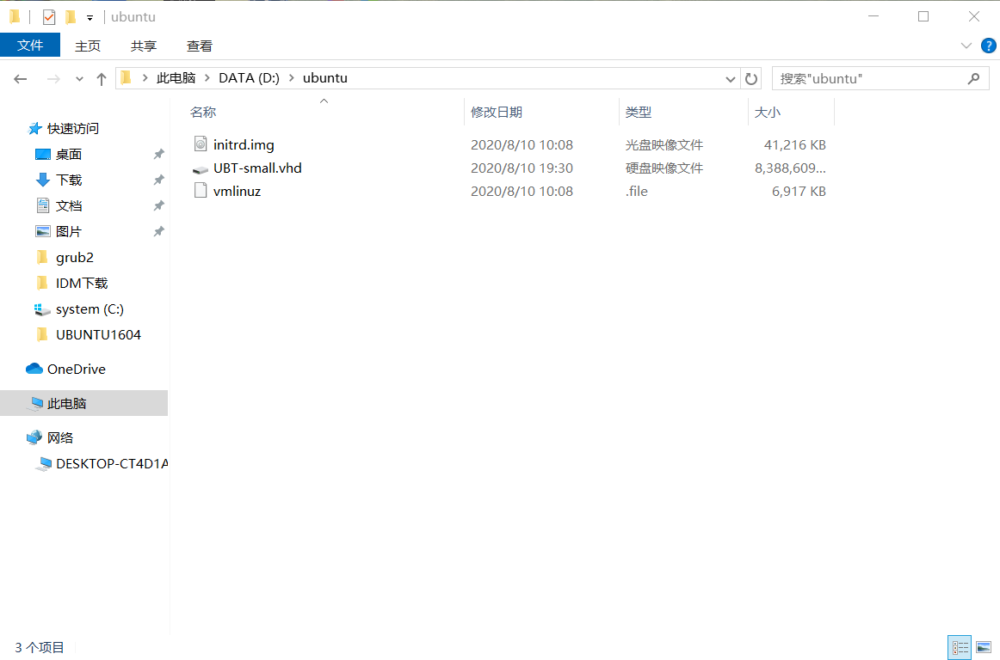
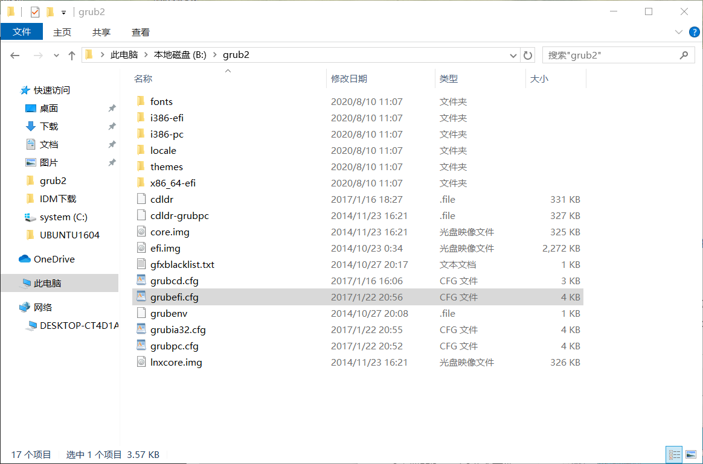
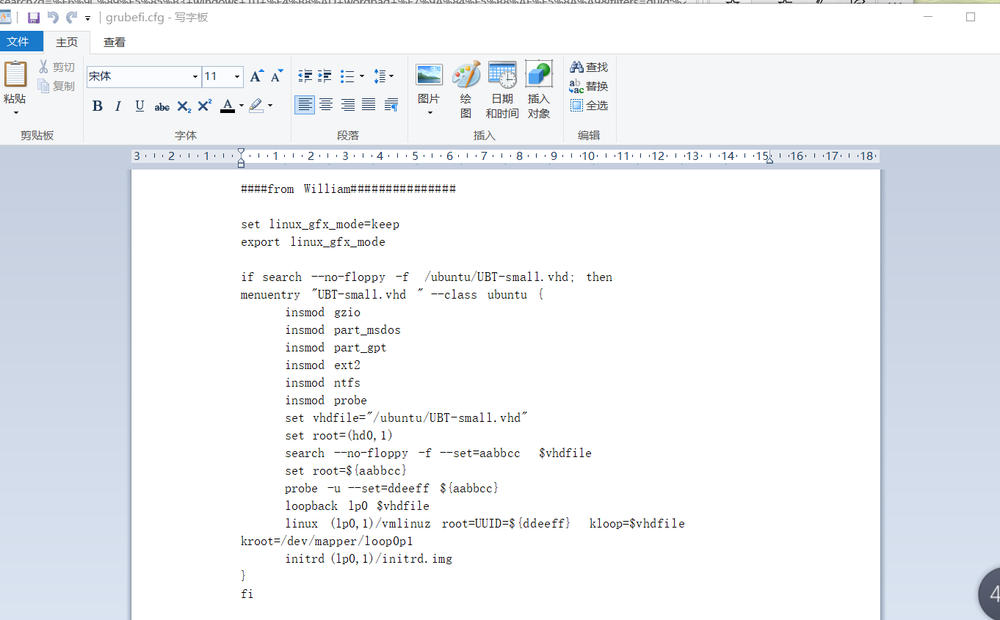

# grub2启动引导vhd中的ubuntu

## 1.所需要的软件

###      1.1  grub2引导程序

###      1.2   EasyUEFI （向bios添加系统引导程序选项的工具）

###      1.3  UBT-small.vhd   vmlinuz   initrd.img

## 2. 安装grub2引导程序

###     2.1   把EFI和grub2两个文件放到ESP分区的根目录 如下图

###       2.2   使用EasyUEFI添加UEFI启动项

## 3. 这一个磁盘下面创建ubuntu文件夹，把 UBT-small.vhd   vmlinuz   initrd.img  三个文件放在该文件夹下

## 4. 配置grub2菜单文件 

### 4.1  修改下吗的gurbefi.cfg添加菜单项

### 4.2 添加下列菜单代码

~~~
if search --no-floppy -f  /ubuntu/UBT-small.vhd; then
menuentry "UBT-small.vhd " --class ubuntu {
	insmod gzio
	insmod part_msdos
	insmod part_gpt
	insmod ext2
	insmod ntfs
	insmod probe
	set vhdfile="/ubuntu/UBT-small.vhd"
	set root=(hd0,1)
	search --no-floppy -f --set=aabbcc  $vhdfile
	set root=${aabbcc}
	probe -u --set=ddeeff ${aabbcc}
	loopback lp0 $vhdfile
	linux	(lp0,1)/vmlinuz root=UUID=${ddeeff}  kloop=$vhdfile  kroot=/dev/mapper/loop0p1
	initrd	(lp0,1)/initrd.img
}
fi

~~~

